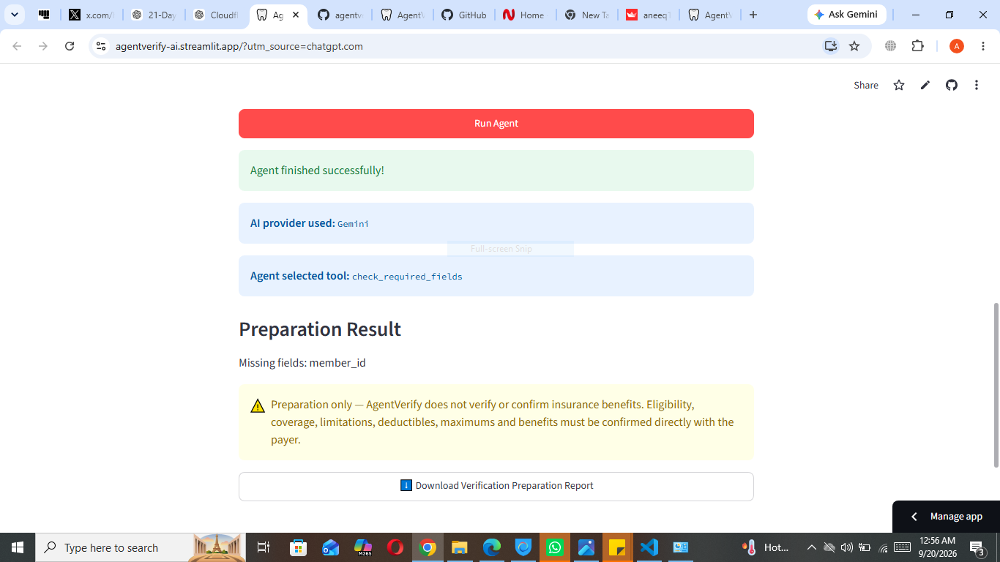

# 🦷 AgentVerify AI v1.1

**AI-assisted workflow preparation for dental insurance verification**

[🚀 Live Demo](https://agentverify-ai.streamlit.app/) | 🎥 Demo Video | 🛠️ Agent Architecture | 🔒 Safety

---

## 🚀 Live Demo

**Try AgentVerify AI:**  
https://agentverify-ai.streamlit.app/

The deployed application runs on Streamlit Community Cloud.

---

## 🎥 Demo Video

Demo video coming soon.

---

## 💡 What It Does

AgentVerify AI is an AI agent designed to demonstrate how AI-assisted tool selection can help prepare dental insurance verification workflows.

The user enters **fictional patient information** and gives the agent a natural-language task.

The agent then:

- analyzes the request
- selects an appropriate verification-preparation tool
- checks required information
- generates payer questions when needed
- creates a structured case summary
- displays which AI provider and tool were selected
- produces a downloadable verification-preparation report

AgentVerify AI **does not perform or confirm actual insurance verification**.

---

## 🤖 Agent Architecture

```text
User Request + Fictional Patient Data
              │
              ▼
       AgentVerify AI
              │
              ▼
       Google Gemini
       (Primary AI)
              │
       ┌──────┴──────┐
       │             │
    Success       API Error
       │             │
       │             ▼
       │      Cloudflare Workers AI
       │          (Backup)
       │             │
       └──────┬──────┘
              ▼
       Agent selects tool
              │
      ┌───────┼────────┐
      ▼       ▼        ▼
 Required   Payer     Case
 Fields    Questions  Summary
      │       │        │
      └───────┼────────┘
              ▼
      Preparation Result
              │
              ▼
      Downloadable Report

```

---

## 📸 Screenshot



---
